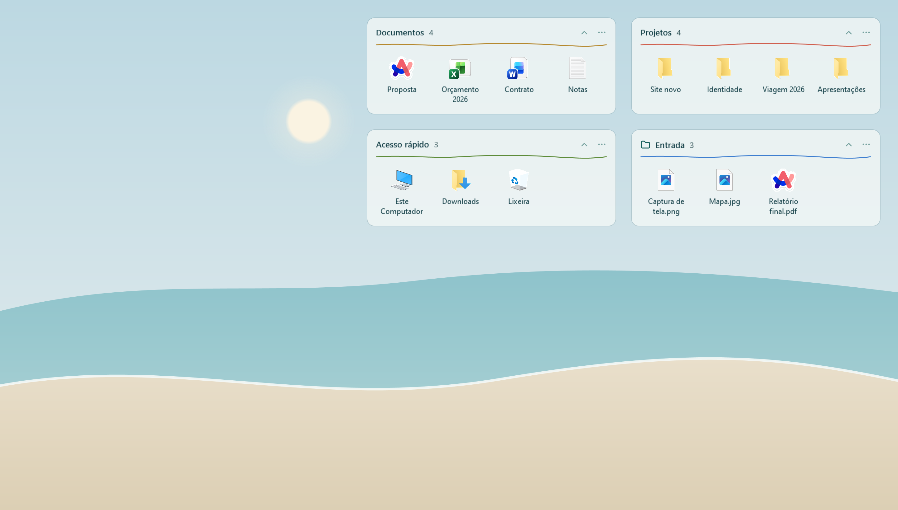
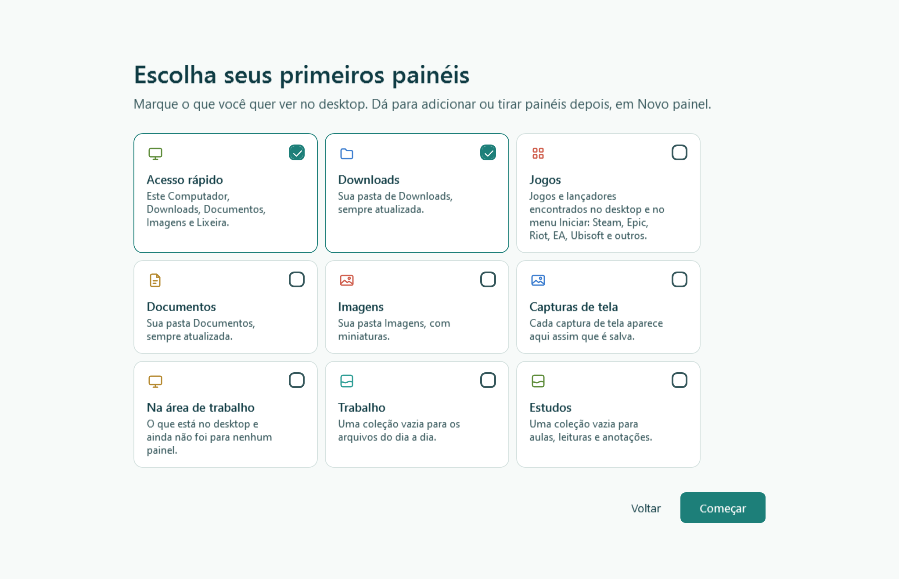

**English** · [Português](README.md)

<p align="center">
  <picture>
    <source media="(prefers-color-scheme: dark)" srcset="assets/brand/logo-dark.svg">
    
  </picture>
</p>

<p align="center">
  Translucent panels that organize the Windows 10 and 11 desktop without moving any of your files.
</p>

<p align="center">
  <a href="https://github.com/ThePlayNEW/orla/releases/latest"></a>
  <a href="https://github.com/ThePlayNEW/orla/releases"></a>
  <a href="LICENSE"></a>
  <a href="https://github.com/ThePlayNEW/orla/actions/workflows/build.yml"></a>
</p>

<picture>
  <source media="(prefers-color-scheme: dark)" srcset="docs/images/hero-dark.png">
  
</picture>

## What it changes

- **Panels on the desktop layer.** They live with the Windows desktop icons, so **Win+D** and the show desktop button leave them in place, and they never cover an application.
- **The desktop keeps working.** In empty areas, rubber-band selection, the right-click menu and dragging files onto the desktop behave as they do in Windows.
- **Collections.** They hold shortcuts to files and folders from anywhere. If you rename the file in File Explorer, the shortcut follows it. Removing an item from a collection never deletes the file.
- **Folder panels.** They show a real folder, such as Downloads, and update on their own when something in it changes.
- **Ctrl+Alt+Space** brings the panels in front of your windows, so you can drop files from File Explorer without minimizing anything. Press it again, or Esc, to send them back to the desktop.
- **Panels that stay tidy.** A panel never sits on top of another, and resizing moves in whole columns and rows of icons.
- **Clean desktop, if you want it.** An option hides the Windows icons and leaves only the panels. A small safeguard process brings the icons back if Orla closes or crashes.
- **Works alongside Wallpaper Engine and Lively.** Orla does not change the wallpaper, does not inject code into Explorer and does not ask for administrator rights.

## Installation

Download from the [releases page](https://github.com/ThePlayNEW/orla/releases/latest):

| File | Who it is for |
| --- | --- |
| [`OrlaDesktop-win-Setup.exe`](https://github.com/ThePlayNEW/orla/releases/latest/download/OrlaDesktop-win-Setup.exe) | Most people. Installs for your user only, without administrator rights, adds a Start menu shortcut and updates itself. |
| [`OrlaDesktop-win-Portable.zip`](https://github.com/ThePlayNEW/orla/releases/latest/download/OrlaDesktop-win-Portable.zip) | People who prefer not to install. Extract it anywhere and run `Orla Desktop.exe`. It does not update itself: download a new ZIP to update. |

The executables are not code-signed yet, so Windows SmartScreen may show a warning the first time. Click **More info**, then **Run anyway**. Signing through the SignPath Foundation is planned.

Requirements: Windows 10 22H2 or Windows 11, 64-bit, with .NET Framework 4.8 (included with Windows).

## Getting started

1. Open Orla. On the **Welcome to Orla Desktop** screen, choose how to start and click **Start**:
   - **Keep my icons** (selected by default): the Windows icons stay where they are, and you pick your first panels in the next step.
   - **Organize my desktop**: what is on your desktop becomes collections, the Windows icons are hidden, and an **On the desktop** panel shows whatever is not organized yet.
2. If you chose **Keep my icons**, tick the panels you want under **Choose your first panels** and click **Start**. Neither option moves any file.
3. Drag a panel by its title to place it. It lines up with the screen edges and with other panels.
4. To change the size, drag any edge or corner of the panel.
5. Drag files from File Explorer onto a panel. With File Explorer open, press **Ctrl+Alt+Space** to bring the panels to the front.
6. To add panels, click the Orla icon in the notification area and use **New panel**.

Orla starts with **Start with Windows** turned on. You can turn it off in **General**.

## Ready-made panels

<picture>
  <source media="(prefers-color-scheme: dark)" srcset="docs/images/presets-dark.png">
  
</picture>

On first run, and later from **New panel**, Orla offers ready-made panels. Only the ones that make sense on your computer are listed. The screenshot shows the Portuguese interface.

| Panel | What it shows |
| --- | --- |
| **Quick access** | This PC, Downloads, Documents, Pictures and Recycle Bin |
| **Downloads** | Your Downloads folder, always up to date |
| **Apps** | The program shortcuts on your desktop, if there are any |
| **Games** | Games and launchers found on the desktop and in the Start menu: Steam, Epic, Riot, EA, Ubisoft, Battle.net, GOG, Rockstar and Xbox |
| **Documents**, **Pictures**, **Screenshots** | Those folders, always up to date |
| **On the desktop** | What is on the desktop and not in any panel yet |
| **Work**, **Study** | Empty collections for you to fill |

**Quick access**, **Downloads** and **Apps** come ticked. Building a ready-made panel never moves or copies a file.

## Shortcuts and gestures

| Where | Action | Result |
| --- | --- | --- |
| Anywhere | **Ctrl+Alt+Space** | Brings the panels in front of your windows, or sends them back |
| Panels in front | Esc | Sends the panels back to the desktop |
| Panel title | Drag | Moves the panel, snapping to edges and other panels |
| Panel title | Double-click | Renames the panel in place |
| Edge or corner | Drag | Resizes the panel |
| Item | Double-click or Enter | Opens the item |
| Item | Ctrl+click, Shift+click, Ctrl+A | Selects several items |
| Empty area of a panel | Drag | Selects the items inside the rectangle |
| Collection item | F2 | Changes the name shown in the panel |
| Collection item | Del | Removes it from the panel without deleting the file |
| Item | Arrow keys | Moves the selection between items |
| Item | Right-click | **Open**, **Show in File Explorer**, **Rename in panel**, **Move to**, **Remove from panel**, **Add to** |
| Notification area icon | Click | Opens Orla |

## Quick answers

The [user guide](docs/en/guide.md) covers every feature and the most common problems: icons that did not come back, a shortcut taken by another program, the SmartScreen warning, panels off screen and Explorer restarts.

## Privacy

Orla collects no data and has no telemetry. Your panels are stored in `%LOCALAPPDATA%\Orla\layout.json`, with the previous copy in `layout.json.bak`.

The only network access is the installed version's update check: at most once a day, Orla asks GitHub for this repository's list of releases, without sending personal data. You can turn it off in **General > Automatic updates**. Links such as **User guide** and **Report a problem** open in your browser only when you click them.

## Compatibility

| Scenario | Status |
| --- | --- |
| Windows 10 22H2, 64-bit | Tested |
| Windows 11 24H2 and 25H2 | Supported by the code, which finds the desktop by window structure. Manual testing still pending. |
| Wallpaper Engine | Tested while running on Windows 10 |
| Lively Wallpaper | Same approach as Wallpaper Engine. Manual testing pending. |
| Multiple monitors | Each panel uses the scale of the monitor it is on. Monitors with different scales have not been tested yet. |
| High Contrast | Uses the system colours, without transparency |
| Languages | Português (Brasil), English, Español, Français, Deutsch, Italiano |
| 32-bit or ARM Windows | Not supported |

Details are in [docs/validation.md](docs/validation.md). If you use Orla on Windows 11, a report in [Issues](https://github.com/ThePlayNEW/orla/issues/new/choose) helps a lot.

## Uninstall

Closing, quitting or uninstalling Orla never leaves your desktop changed: the Windows icons go back to following your File Explorer setting.

- **Installed version:** open **Settings > Apps**, find **Orla Desktop** and click **Uninstall**. Starting with Windows is removed as well.
- **Portable version:** in Orla, under **General**, turn off **Start with Windows**. Then right-click the notification area icon, choose **Quit and restore the desktop** and delete the folder you extracted the ZIP into.

In both cases your panels stay saved in `%LOCALAPPDATA%\Orla` in case you come back. To delete them, type `%LOCALAPPDATA%` in File Explorer's address bar and delete the `Orla` folder. Your files are not affected.

## For developers

Orla is a WPF application for .NET Framework 4.8, built with the .NET SDK 10 or newer.

```powershell
./build.ps1     # Release build
./test.ps1      # runs the xUnit tests
./package.ps1   # writes the packages to artifacts/
```

The installer and the portable ZIP are built by [Velopack](https://velopack.io) and need the `vpk` tool (`dotnet tool install -g vpk`). Without it, `package.ps1` writes a plain ZIP only. Releases are produced by the `release.yml` workflow when a `v*.*.*` tag is pushed.

Command-line options:

```text
Orla.exe                      normal use
Orla.exe --settings           opens the Orla window
Orla.exe --smoke report.json  integration check with temporary data, never hides icons
Orla.exe --render <folder>    regenerates the documentation images with demo data
```

| Folder | Contents |
| --- | --- |
| `src/Orla` | The app: `Shell` (Windows integration), `Panels`, `Central` (the Orla window), `Model`, `Strings`, `Themes` |
| `tests/Orla.Tests` | Persistence, migration and translation tests |
| `assets` | Brand and interface glyph SVGs |
| `tools/icons` | Generates the `.ico` files, `Glyphs.xaml` and `Brand.xaml` from the SVGs (`npm install`, then `npm run export`) |
| `docs` | Guides, architecture, validation and images |

Read [docs/architecture.md](docs/architecture.md) before changing the desktop integration, and [CONTRIBUTING.md](CONTRIBUTING.md) before opening a pull request. To report a security issue, see [SECURITY.md](SECURITY.md).

## License

[MIT](LICENSE) © Eduardo Torres. Third-party components are listed in [THIRD_PARTY_NOTICES.md](THIRD_PARTY_NOTICES.md).
