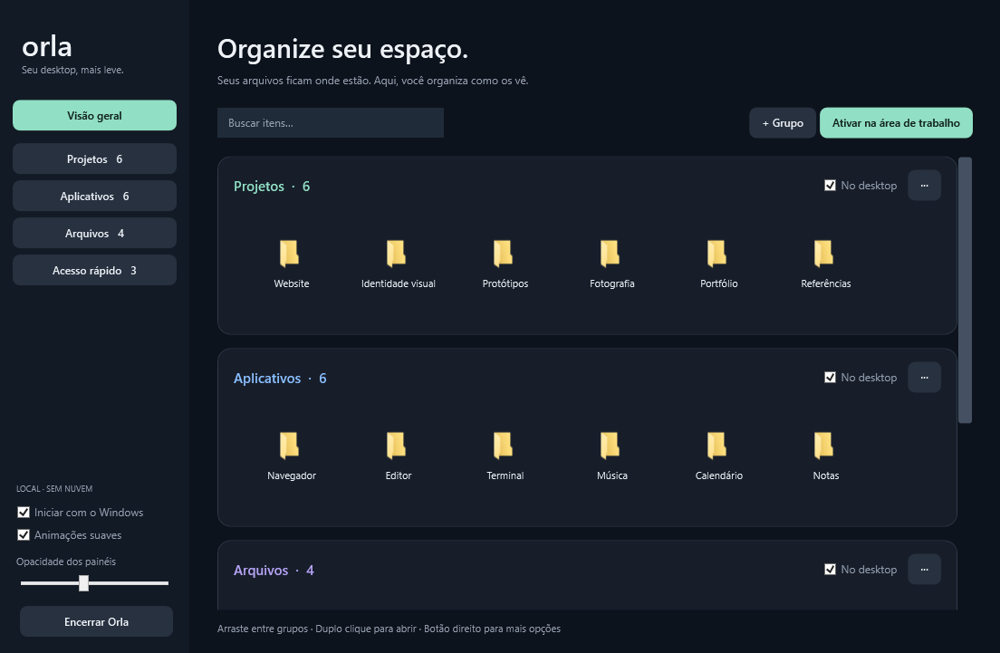

# Orla

A quieter Windows desktop. Organize shortcuts in translucent, movable panels while keeping your files exactly where they are.

[Download](https://github.com/ThePlayNEW/orla/releases) · [Report an issue](https://github.com/ThePlayNEW/orla/issues) · [Architecture](docs/architecture.md)



The screenshot uses demonstration items. The organization window is opened on demand; normal use happens directly on the desktop.

## Features

- Translucent panels with adjustable opacity, color, position and size.
- Drag references between groups without moving their files.
- Drop files, folders and shortcuts from Explorer into the organization window to add them.
- Double-click or press Enter to open an item; right-click for more actions.
- Collapse groups and choose which groups appear on the desktop.
- Search, rename groups and edit item labels from the organization window.
- Brief transitions that respect Windows' animation preference, with an additional off switch.
- Local configuration, atomic saves and a recovery backup.
- Restore the original desktop from the tray. A small companion process also restores its icons if the main process crashes.
- Startup with Windows enabled on first launch and configurable in the organization window.

## Getting started

1. Download the portable ZIP from [Releases](https://github.com/ThePlayNEW/orla/releases).
2. Extract it to a permanent directory and run `Orla.exe`.
3. Orla imports visible top-level desktop items as references and displays its panels.
4. Double-click the Orla tray icon to organize groups. Running the executable again also opens this window.

Drag a panel's heading to reposition it. Drag its bottom-right handle to resize it. The minus button collapses it; the menu button opens that group's settings.

**Startup:** the first launch creates an `Orla.lnk` shortcut in the current user's Startup folder. Uncheck **Iniciar com o Windows** to disable it. Keep the portable directory in its permanent location; if you move it, toggle startup off and on to update the shortcut.

**Restoring the desktop:** use **Ativar / restaurar desktop** or **Sair e restaurar ícones** in the tray menu. Orla never deletes your original desktop items.

## Requirements and compatibility

- Windows 10 22H2 or Windows 11, x64.
- .NET Framework 4.8 or newer.
- A normal interactive Windows Explorer desktop.

Orla uses WPF and Win32 APIs shared by Windows 10 and 11. Desktop integration has been exercised on Windows 10 22H2; Windows 11 remains a manual release-validation target. CI builds and tests on Windows Server runners do not substitute for Windows 11 desktop testing.

Orla does not replace the wallpaper, reparent its windows, inject into Explorer, or use an always-on-top overlay. Panels sit above the desktop shell and yield to applications. This approach is intended to coexist with Wallpaper Engine and similar tools, but third-party wallpaper engines and every multi-monitor configuration are not yet certified. The current layout is constrained to the primary monitor's work area.

## Lightweight by design

No embedded browser, telemetry, background indexing, continuous animation loop or periodic desktop polling. Window focus events drive panel visibility. The organization window is created only when requested; native icons and button templates are cached. The restoration companion blocks on process exit rather than polling.

See [validation](docs/validation.md) for measured results and known limits. Memory use includes the .NET/WPF runtime and varies with the number of icons and whether the organization window has been opened.

## Build and test

The quick build uses the C# compiler included with .NET Framework and requires no package restore:

```powershell
./build.ps1
./test.ps1
./package.ps1
```

Alternatively, open `Orla.csproj` in Visual Studio with the .NET desktop development workload and the .NET Framework 4.8 targeting pack.

The portable archive is written to `artifacts/orla-windows-x64.zip`. `test.ps1` covers grouping, reference deduplication, file preservation, persistence, bounds and backup recovery. Desktop integration tests are intentionally separate from headless CI.

Useful options:

```text
Orla.exe                         start the desktop panels
Orla.exe --settings              open the organization window
Orla.exe --self-test report.txt   run non-destructive model tests
Orla.exe --smoke report.json      test shell integration and restoration
Orla.exe --render preview.png --demo
```

`--smoke` briefly hides and restores desktop icons. Run it only in an interactive test session. Rendering and test modes use temporary configuration and never enable startup.

## Configuration and removal

Configuration lives at `%LOCALAPPDATA%\Orla\layout.json`, with `layout.json.bak` as the previous saved version. Personal paths stay on the machine and are not part of the repository or release archive.

To remove Orla, disable startup, exit it from the tray, and delete its portable directory. You can also remove `%LOCALAPPDATA%\Orla` to discard the saved layout. Original files remain untouched.

## Contributing

Use English names and camelCase for variables, parameters, fields and application methods. Types and serialized public properties use PascalCase; platform API names retain their original spelling. Keep dependencies and comments purposeful. Build and run tests before submitting a change.

## License

[MIT](LICENSE) · Eduardo Torres
