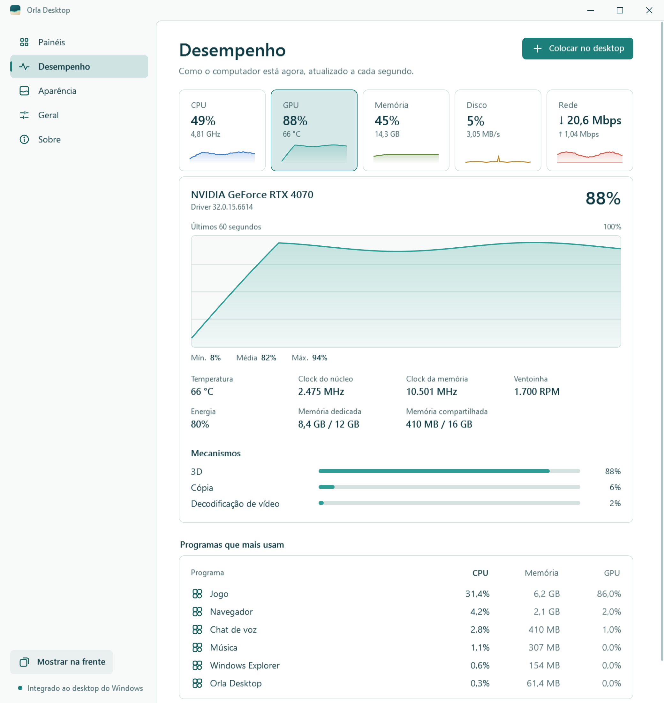
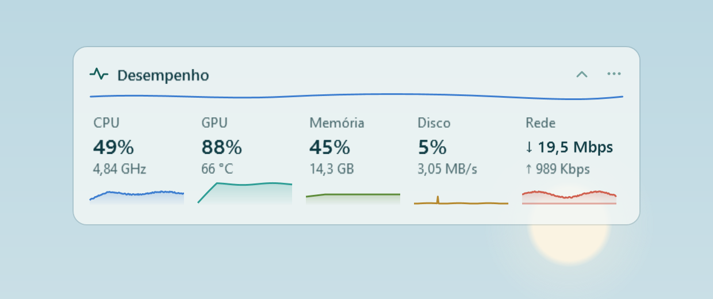

**English** · [Português](../pt-BR/guia.md)

# Orla Desktop user guide

Orla places translucent panels on the Windows desktop. Each panel shows shortcuts or the contents of a folder. Your files stay where they are; Orla only changes how you see them.

- [How panels work](#how-panels-work)
- [First run](#first-run)
- [Let Orla organize](#let-orla-organize)
- [Ready-made panels](#ready-made-panels)
- [Collections and folder panels](#collections-and-folder-panels)
- [Moving, resizing and arranging](#moving-resizing-and-arranging)
- [Items in panels](#items-in-panels)
- [Drag and drop](#drag-and-drop)
- [The keyboard shortcut](#the-keyboard-shortcut)
- [Quick search](#quick-search)
- [Performance](#performance)
- [Clean desktop](#clean-desktop)
- [The Orla window](#the-orla-window)
- [Keyboard](#keyboard)
- [Multiple monitors](#multiple-monitors)
- [Where your data lives](#where-your-data-lives)
- [Troubleshooting](#troubleshooting)
- [Frequently asked questions](#frequently-asked-questions)
- [Uninstall](#uninstall)

## How panels work

Panels sit on the same layer as the desktop icons, inside the Explorer window that holds those icons. As a result:

- **Win+D** and the show desktop button at the end of the taskbar leave the panels in view.
- A panel never covers an open application. When a window is above the desktop, it is also above the panels.
- In desktop areas without a panel, everything works as it does in Windows: rubber-band selection, the right-click menu and dragging files onto the desktop.

The keyboard shortcut, **Ctrl+Alt+Space** by default, hides or shows the panels when the desktop is in view and brings them to the front when a window is on top. See [The keyboard shortcut](#the-keyboard-shortcut).

The Orla icon sits in the notification area, next to the clock. A click opens the Orla window. A right-click shows a menu with **Open Orla**, **Hide panels** (or **Show panels**), **Show panels in front**, **Organize for me**, **Lock panels**, **Clean desktop** and **Quit and restore the desktop**.

## First run

<picture>
  <source media="(prefers-color-scheme: dark)" srcset="../images/welcome-dark.png">
  
</picture>

The first time Orla opens, the **Welcome to Orla Desktop** screen offers two ways to start. Pick one and click **Start**. The screenshots show the Portuguese interface; the options are the same in every language.

| Option | What happens |
| --- | --- |
| **Let Orla organize** (recommended, selected by default) | Orla reads the desktop, builds panels by category and shows a preview before anything changes. See [Let Orla organize](#let-orla-organize). |
| **Keep my icons** | The Windows icons stay as they are. In the next step, **Choose your first panels**, you tick the [ready-made panels](#ready-made-panels) you want and click **Start**. **Back** returns to the first step. |

Neither option moves, renames or deletes a file. You can change everything later.

As soon as the panels appear, a six-tip tour goes over them on the desktop itself: moving by the title, resizing from the edges, the **···** menu, the search bar, the shortcut, and the notification area icon. **Next** (or Enter) moves on, **Skip** (or Esc) closes it. To see it again, use **About > Orla tour**.

## Let Orla organize

<picture>
  <source media="(prefers-color-scheme: dark)" srcset="../images/organize-dark.png">
  
</picture>

Orla can build the panels for you, the way a person would tidy the desktop. Use it on first run with **Let Orla organize**, or at any time from **Panels > Organize for me**.

1. Orla reads your desktop and the Windows public desktop.
2. The **Your desktop, organized** screen shows a map of your main screen with each panel where it will go.
3. Choose the options and click **Organize**. **Back** leaves without changing anything.

How it sorts items:

| Panel | What goes in |
| --- | --- |
| **Apps** | Browsers, chat, music and every other program |
| **Development** | Code editors, Git, Docker, databases, terminals |
| **Creative** | Image and video editing, design, streaming |
| **Utilities** | Scripts (`.bat`, `.cmd`, `.ps1`), peripherals, drivers and system tools |
| **Games** | Games and launchers (Steam, Epic, EA, Riot, Rockstar, FiveM, Minecraft and more) |
| **Folders** | The folders on your desktop |
| **Documents**, **Pictures and videos**, **Files** | Loose files on the desktop, by type. Installers and archives go to **Files**. |
| **Quick access** | This PC, Downloads, Documents, Pictures and Recycle Bin |

- A shortcut is sorted by the program it opens, not by its name.
- A folder that only holds shortcuts and scripts, such as `Shortcuts\Games`, is read from the inside. If its name points to a category (Games, Dev, Utilities, Peripherals, Apps…), that category applies to what is inside.
- A category with a single item joins the closest one: a lone game goes to **Apps**, a lone PDF goes to **Files**.
- Tools are stacked in columns from the left of the main screen; folders, files and **New on desktop** from the right. The middle stays free.
- Panels show shortcuts. No file moves.

### Organizing again

If you already used **Let Orla organize**, the preview shows two ways at the top:

| Way | What it does |
| --- | --- |
| **Complete my panels** (default) | Adds only what is new on the desktop. Items go into the panels you already have; a new panel appears only for a category none of them covers, in free space. Names, colours, positions, sizes and what you moved stay as they are. On the map, new panels stand out, panels that get items show how many (for example **+3**), and the rest are dimmed. |
| **Start fresh** | Builds every panel again, as on the first time. |

### Orla learns from you

When you drag an item from one panel to another, or from the desktop (and **New on desktop**) into a panel, Orla remembers where it went, by what the shortcut opens, with its arguments, or else the file name. The next time you organize, and with **Keep organized** on, that item goes straight to that panel, even a panel you made yourself. **Start fresh** carries the rules over to the new panel for the same category; rules about a panel you deleted go away with it.

### With two monitors

With more than one monitor, the preview shows all of them and offers **Use the second monitor**, already on. Tools go to the other monitor, on the side next to the main screen, and folders, files and **New on desktop** stay on the main screen. **Complete my panels** does not move anything between monitors.

The two options in the preview:

| Option | What it does |
| --- | --- |
| **Hide the Windows icons** | Turns on [Clean desktop](#clean-desktop) and creates the **New on desktop** panel with what is not in any panel yet. If you turn it off, the Windows icons stay and that panel is not created, because the icons already show what is new. |
| **Keep organized** | Each new item on the desktop goes to its category's panel by itself, a few seconds after it arrives. An item deleted or moved off the desktop leaves its panel. Anything that fits nowhere stays in **New on desktop**. You can turn it on or off later in **Panels**. |

With **Start fresh**, the panels you had are replaced. A copy of the previous layout stays in the [data folder](#where-your-data-lives) as `layout.json.before-organize-` followed by the date, and **Panels > Restore previous panels** undoes the organization, even after Orla is closed and opened again. Each copy undoes once.

## Ready-made panels

<picture>
  <source media="(prefers-color-scheme: dark)" srcset="../images/presets-dark.png">
  
</picture>

Ready-made panels help you start quickly. They appear in the second step of the first run and, later, under the **New panel** button on the **Panels** page. Orla lists only the ones that make sense on your computer.

| Panel | Type | What it shows |
| --- | --- | --- |
| **Quick access** | Collection | This PC, Downloads, Documents, Pictures and Recycle Bin |
| **Downloads** | Folder panel | Your Downloads folder |
| **Apps** | Collection | The program shortcuts on your desktop. Listed only if there are any. |
| **Games** | Collection | Games and launchers found on the desktop and in the Start menu |
| **Documents** | Folder panel | Your Documents folder |
| **Pictures** | Folder panel | Your Pictures folder, with thumbnails |
| **Screenshots** | Folder panel | The Screenshots folder inside Pictures. Listed only if it exists. |
| **Recent** | Folder panel | The files you opened last, newest first (up to 40) |
| **Performance** | Sensors | Live CPU, GPU, memory, disk and network. See [Performance](#performance). |
| **New on desktop** | Folder panel | What is on the desktop and not in any panel yet. Pairs well with Clean desktop. |
| **Work** | Collection | Empty, for you to fill |
| **Study** | Collection | Empty, for you to fill |

On first run, **Quick access**, **Downloads**, **Apps** and **Performance** come ticked.

The **Games** panel recognizes a shortcut by where it points: Steam links (`steam://`) and Epic links (`com.epicgames.launcher://`), Riot, EA, Ubisoft, Battle.net, GOG and Rockstar links, or the folders where those stores and Xbox install games. If a game is missing, drag its shortcut onto the panel.

Building a ready-made panel never moves or copies a file. Collections hold shortcuts, and folder panels show each folder where it already is.

## Collections and folder panels

| | Collection | Folder panel |
| --- | --- | --- |
| Shows | Shortcuts to files, folders and locations anywhere | The real contents of one folder |
| When you drop files | Creates shortcuts; the files stay where they are | Moves or copies the files into the folder |
| When you remove an item | Removes only the shortcut | Not applicable; the panel always mirrors the folder |
| Updates | A shortcut follows its file when you rename it in File Explorer | Automatically, when something in the folder changes |

### Collections

A collection gathers shortcuts to what you use, wherever it lives: a project folder on another drive, a spreadsheet in Documents, an application. The file never moves.

If the file is renamed in File Explorer, the collection item follows it. If the file is deleted, or its drive is disconnected, the item is dimmed and marked with a warning sign. Its tooltip says "This item is no longer here." Use the item's menu to take it out of the panel.

To add items without dragging, open the panel's **···** menu and choose **Add files…** or **Add folder…**.

### Folder panels

A folder panel shows what is inside a folder, folders first and in alphabetical order, as File Explorer sorts them. Hidden and system files are not shown. The panel updates on its own when something in the folder is created, deleted or renamed.

Double-click a subfolder to go into it right there. The title shows the path, such as **Projects › FiveM**, and the **‹** button (or Backspace, or Alt+←) goes back one level. Files dragged onto the panel go to the folder it shows at that moment. To open the subfolder in File Explorer, Ctrl+double-click it or use **Open in File Explorer** in its menu. When Orla opens again, the panel is back at its own folder.

The **New on desktop** panel shows your desktop and the Windows public desktop. In its **···** menu, **Show only what is not in another panel** hides what another panel already shows: the item itself, a folder whose shortcuts are in collections, or a folder that has its own panel. Anything you save to the desktop later appears there until you organize it.

If a panel's folder cannot be found, for example because the drive is disconnected, the panel says: "This panel's folder was not found. Check that the drive is connected."

### Creating, hiding and removing panels

In the Orla window, under **Panels**, the **New panel** button opens a list with:

- the [ready-made panels](#ready-made-panels) available on your computer;
- **New collection**, which asks for a name and creates an empty collection;
- **Folder panel**, which asks for the folder the panel will show.

A new panel goes into the first free spot along the right edge of the screen, lined up with the others. Every panel keeps the same distance from the edge of the screen, whether Orla placed it or you dragged it there.

In the panel list:

- Each folder panel shows its folder's name. Hover over it to see the full path.
- The **On desktop** switch shows or hides each panel without deleting it.
- Each row's **···** menu has **Rename panel**, **Line colour**, **Open folder** (for folder panels) and **Remove panel…**.

On the panel itself, the **···** menu (**More options**) offers:

- In collections: **Add files…** and **Add folder…**.
- In folder panels: **Open folder**.
- In every panel: **Rename panel**, **Line colour**, **Collapse** or **Expand**, **Automatic height**, **Hide panel**, **Open Orla** and **Remove panel…**.

Removing a panel never deletes files. For a collection, only the shortcuts go away. For a folder panel, the folder stays intact.

**Line colour** changes the thin line under the title: **Sea glass**, **Sand**, **Coral**, **Sky** or **Moss**.

## Moving, resizing and arranging

- **Move:** drag the panel by its title. While you drag, it sticks to the screen margins and to the edges of nearby panels, keeping the same gap, and stays inside the screen's work area.
- **Resize:** drag any edge or corner. A thin accent line shows the edge under the pointer. The panel follows the pointer and shows its size in columns × rows. When you let go, it glides to whole columns and rows of icons, so there is never an empty strip. Edges stop at the screen margin and at neighbouring panels.
- **Automatic height:** on for new panels. The panel is as tall as its content, up to its set number of rows; beyond that, it scrolls. Changing the height with the mouse turns it off, and the panel keeps exactly the rows you chose. To turn it back on, double-click the top or bottom edge, or tick **Automatic height** in the **···** menu.
- **No overlap:** a panel never sits on top of another. If you drop or grow a panel onto another one, it moves to the nearest free spot.
- **Rename:** double-click the title, type the new name and press Enter. Esc cancels.
- **Collapse:** the chevron on the right of the title bar leaves only the title bar in view. Click it again to expand.
- **Lock:** in **General**, **Lock position and size** prevents accidental moves and resizes. The same setting is in the notification area menu as **Lock panels**.
- **Align:** on the **Panels** page, **Align panels**, below the list, lines up the visible panels on the main screen the same way as **Let Orla organize**: tools on the left (when Clean desktop is on), everything else on the right and the middle free. Panels on each side get the same width, and collapsed panels stay collapsed.

## Items in panels

| To | Do this |
| --- | --- |
| Open | Double-click or Enter |
| Select several | Ctrl+click, Shift+click, Ctrl+A, or drag a rectangle over an empty area of the panel |
| Change the displayed name (collections) | F2, or **Rename in panel** in the item menu |
| Take it out of the panel (collections) | Del, or **Remove from panel** in the item menu |
| Send it to another collection | Drag it there, or use **Move to** in the item menu |
| Put a folder panel's file in a collection | **Add to** in the item menu, or drag it to the collection |
| See the file in File Explorer | **Show in File Explorer** in the item menu |

**Rename in panel** changes only the displayed name. The file keeps its original name.

With several items selected, you can drag, open or remove them together.

## Drag and drop

| From | To | Result |
| --- | --- | --- |
| File Explorer or desktop | Collection | Creates shortcuts. The files stay where they are. |
| Collection | Another collection | Moves the shortcut to the other collection |
| Collection | The same collection | Changes the order of the items |
| Collection | File Explorer or desktop | Copies the file, or creates a shortcut if you hold Alt. The original never moves. |
| Collection | Folder panel | Copies the file into the folder. The original never moves. |
| File Explorer or desktop | Folder panel | Moves the file into the folder if it is on the same drive, or copies it if it is on another drive |
| Folder panel | Collection | Creates a shortcut to the file |
| Folder panel | File Explorer or desktop | Follows the normal Windows rules, because the file is real |

While you drag items from Orla, a translucent preview of the item follows the pointer, with a count when there are several, over Orla and over other programs. In collections, a line shows exactly where the items will land, in the same panel or another one. Near the top or bottom edge of a panel, it scrolls by itself. After the drop, the moved items stay selected in the destination. Files dragged from File Explorer show Windows' own drag image over the panels.

When dropping onto a folder panel, hold **Ctrl** to copy or **Shift** to move, as in File Explorer. The operation uses Windows' own dialog, with progress and name-conflict handling, and can be undone with Ctrl+Z in File Explorer.

## The keyboard shortcut

The shortcut is **Ctrl+Alt+Space** by default, and you can change it in **General**. It does what the moment calls for:

| Situation | What the shortcut does |
| --- | --- |
| Desktop in view (the desktop, the taskbar or a panel has focus) | Hides the panels, or shows them again. With **Clean desktop** on, the Windows icons come back while the panels are hidden. |
| An application window in front | Brings the panels in front of your windows, with the [search bar](#quick-search) ready for typing. Press it again, or Esc, to send them back to the desktop. |

Panels always start visible when Orla opens.

### Dropping files while windows are open

Normally, open windows sit above the panels. To drop a file from File Explorer onto a panel without minimizing anything:

1. With the File Explorer window in front, press the shortcut. The panels appear in front of every window.
2. Drag the file from File Explorer onto the panel.
3. Press the shortcut again, or Esc while a panel has focus, to send the panels back to the desktop.

Opening an item or using **Show in File Explorer** also sends the panels back.

### From the notification area and the Orla window

The notification area menu has **Hide panels** (or **Show panels**, when they are hidden) and **Show panels in front**, with the current shortcut next to them. In the Orla window, the **Show in front** button does the same; while the panels are in front, it reads **Back to the desktop**.

### Changing the combination

In **General**:

- **Keyboard shortcut** turns the shortcut on or off. Its description shows the current combination.
- Under **Key combination**, click the button and press the new combination: Ctrl, Alt or Win together with another key. Esc cancels.
- **Restore default** goes back to **Ctrl+Alt+Space**.

If another program already uses the combination you pick, Orla keeps the previous one and tells you. See [The shortcut does not work](#the-shortcut-does-not-work).

## Quick search

<picture>
  <source media="(prefers-color-scheme: dark)" srcset="../images/search-dark.png">
  
</picture>

The search bar always sits at the top of the main screen, in the middle the panels leave free. It looks through everything your panels show, including what is inside folder panels. To use it:

- click it;
- start typing with a panel selected;
- with a window in front, press the shortcut: the panels and the bar come above it, ready for typing;
- use **Search your panels** in the notification area menu.

Accents and case do not matter. Names that start with what you typed come first, then names with a word that starts that way. Use the arrow keys to choose, **Enter** to open and **Ctrl+Enter** to show the item in its folder. **Esc** clears the text; a second **Esc** takes the focus away from the bar. The results show only while the bar has the focus; the bar stays in place. When the shortcut is on, the bar shows it on the right.

## Performance

<picture>
  <source media="(prefers-color-scheme: dark)" srcset="../images/performance-dark.png">
  
</picture>

The **Performance** page shows how your computer is doing right now, with the same numbers as Task Manager:

- **CPU:** use, current and base speed, cores and threads, processes, up time and the use of each thread.
- **GPU:** use, temperature, core and memory clock, fan, power, dedicated and shared memory, driver and the engines that worked in the last minute (3D, copy, video). With two cards, choose **GPU 0** or **GPU 1**.
- **Memory:** in use, available, committed, type, speed and slots.
- **Disk:** read, write and the active time of each disk, with its model and kind (NVMe, SSD or HDD).
- **Network:** what comes in (strong line) and what goes out (faint line), in Kbps or Mbps.
- **Battery**, on laptops.

Click a card to see its details. The chart shows the last 60 seconds; point at it to read the value of each second. Below the chart are the minute's lowest, average and highest values.

**Programs using the most** shows each program's CPU, memory and GPU side by side, grouped as Task Manager groups them. Click a column heading to sort by it. **Open Task Manager** opens the one in Windows.

GPU temperature, fan and power come from the display driver. When the driver does not report one, it is left out, and temperature shows **—**. CPU temperature also shows **—**, because Windows does not report it without an extra driver, and Orla does not install drivers.

### Performance panel

<picture>
  <source media="(prefers-color-scheme: dark)" srcset="../images/sensors-dark.png">
  
</picture>

**Add to desktop**, on the **Performance** page, creates a panel with CPU, GPU, memory, disk and network, each with its value and a chart of the last minute. It is also in **New panel > Performance**. It moves, resizes and hides like any panel. Double-click a sensor to open its details.

The sensors are read only while the page or a performance panel is open, twice a second, off Orla's main thread. Reading them costs less than 0.5% of the processor. Nothing leaves your computer.

## Clean desktop

**Clean desktop** hides the Windows icons and leaves only the panels. It is off unless you use **Let Orla organize** with **Hide the Windows icons** on. To turn it on or off, use **General > Clean desktop** or the **Clean desktop** item in the notification area menu.

While it is on:

- The Windows icons and rubber-band selection on the desktop are unavailable.
- Your files stay in the desktop folder. To see them, use the **New on desktop** panel from **New panel**, or create a **Folder panel** for the desktop.

### How Orla protects your icons

Before hiding the icons, Orla starts a small safeguard process, a second copy of Orla without a window. It waits for Orla to end, however that happens, and then brings the icons back.

The icons come back when you:

- turn off **Clean desktop**;
- choose **Quit and restore the desktop** or **Quit Orla**;
- uninstall Orla;
- or when Orla crashes or is ended from Task Manager.

The state restored is your File Explorer setting, under **View > Show desktop icons** in the desktop's right-click menu. If you turned the icons off there yourself, they stay off.

If Orla cannot start the safeguard, it does not hide the icons and says: "Orla could not start the safeguard that brings the icons back. The Windows icons stay visible."

## The Orla window

Open it with a click on the notification area icon, from a panel's **···** menu (**Open Orla**), or by running Orla again.

<picture>
  <source media="(prefers-color-scheme: dark)" srcset="../images/central-dark.png">
  
</picture>

The window has five pages:

- **Panels:** create, show, hide and remove panels. See [Creating, hiding and removing panels](#creating-hiding-and-removing-panels).
- **Performance:** CPU, GPU, memory, disk, network and the programs using the most. See [Performance](#performance).
- **Appearance:** theme, opacity, icons and animations, with a live preview.
- **General:** startup, language, **Clean desktop**, locking, the shortcut and **Start over**.
- **About:** version, **Orla tour**, **Updates**, your data folder, **User guide**, **Report a problem** and **Quit Orla**.

The Orla window has its own title bar, with **Minimize**, **Maximize** and **Close** in the corner, and still snaps to the screen edges like any window. Closing the window does not close Orla: the panels stay on the desktop, and the notification area icon opens the window again. Confirmations that remove or reset something have a red button.

At the bottom of the sidebar, **Part of the Windows desktop** means the panels are on the desktop layer. If it says **Compatibility mode: the Windows desktop was not found.**, see [Troubleshooting](#orla-shows-compatibility-mode).

### Appearance

<picture>
  <source media="(prefers-color-scheme: dark)" srcset="../images/appearance-dark.png">
  
</picture>

| Setting | Options |
| --- | --- |
| **Theme** | **System** follows the Windows app theme as soon as you change it. **Light** and **Dark** fix a theme. |
| **Panel opacity** | From 75% to 95%. The minimum keeps text readable over any wallpaper. |
| **Icon size** | **Small**, **Medium** or **Large** |
| **Animations** | Short transitions when panels appear. If animations are off in Windows, Orla does not animate either. |

Theme and opacity changes apply right away, to the panels and to the Orla window.

With Windows High Contrast on, Orla uses the system colours and turns off transparency.

### General

| Setting | What it does |
| --- | --- |
| **Start with Windows** | Opens your panels when you sign in. On by default. |
| **Language** | **System** follows the Windows display language. You can also pick Português (Brasil), English, Español, Français, Deutsch or Italiano. The change applies immediately. |
| **Clean desktop** | Hides the Windows icons. See [Clean desktop](#clean-desktop). |
| **Lock position and size** | Prevents moving or resizing panels |
| **Start over** | The **Start over…** button removes every panel, returns settings to their defaults and opens **Welcome to Orla Desktop**, as after a fresh install. First, Orla keeps a copy of the current layout in its data folder as `layout.json.before-reset-<date>`. None of your files are moved or deleted, and **Start with Windows** stays as it was. To go back to the previous layout, quit Orla and rename that copy to `layout.json`. |
| **Keyboard shortcut** | Turns the shortcut on or off. When it is on, the combination shows right below: click it and press the new one; **Restore default** goes back to **Ctrl+Alt+Space**. See [The keyboard shortcut](#the-keyboard-shortcut). |

Settings are grouped under **Startup**, **Desktop** and **Advanced**. **Align panels** is on the **Panels** page, below the list, and **Automatic updates** is under **About**, next to **Check now**.

### Updates

Both the installed and the portable version look for a new release on GitHub a minute after they start and then every six hours. You never need to go back to GitHub or download anything. When it finds one, it downloads it in the background and applies it the next time Orla closes. If you shut down Windows with Orla open, the update is applied the next time Orla starts, which takes a second or two before the panels appear. The check asks GitHub for this repository's list of releases and sends no personal data. On the **About** page, the **Updates** card shows when Orla last looked and has a **Check now** button. When a new version is ready, the button becomes **Restart and update** to install it right away. After an update, a notification leads to what is new in that version. To turn the automatic checks off, use **Automatic updates** under **About**; **Check now** still works.

To update itself, the portable version must be in a folder you can write to, such as Documents or Downloads. Your panels live in `%LOCALAPPDATA%\Orla` and are not affected.

## Keyboard

| Key | Where | Action |
| --- | --- | --- |
| Ctrl+Alt+Space (default, configurable) | Desktop in view | Hides or shows the panels |
| Ctrl+Alt+Space (default, configurable) | Application window in front | Brings the panels to the front, or sends them back |
| Esc | Panels in front, with focus | Sends the panels back to the desktop |
| Enter | Item | Opens it |
| Arrow keys | Item | Moves the selection |
| Ctrl+A | Panel | Selects every item |
| F2 | Collection item | **Rename in panel** |
| Del | Collection item | **Remove from panel** |
| Menu key | Item | Opens the item menu |
| Enter or Esc | Title being edited | Confirms or cancels the new name |

## Multiple monitors

You can place panels on any monitor. Each panel uses the scale of the monitor it is on and stays inside that monitor's work area. If a monitor is disconnected, its panels move to the nearest remaining monitor. **Rearrange panels** brings every visible panel to the main screen.

Monitors with different scales, such as a laptop at 150% with an external monitor at 100%, have not been tested yet. If something looks out of place in that setup, [report it](https://github.com/ThePlayNEW/orla-desktop/issues/new/choose).

## Where your data lives

Everything is in `%LOCALAPPDATA%\Orla`, for both the installed and the portable version. Under **About**, the **Open folder** button opens it.

| File | Contents |
| --- | --- |
| `layout.json` | Panels, items, positions and settings |
| `layout.json.bak` | The previous version, created on every save |
| `layout.json.corrupt-<date>` | A copy of a file that could not be read, kept so nothing is lost |
| `layout.json.before-organize-<date>` | The panels from before each **Let Orla organize**, for **Restore previous panels** |
| `orla.log` | Unexpected errors, if any, with paths in your user folder written as `%USERPROFILE%` |

Orla writes to a temporary file first and then swaps it in, so a power cut during a save does not corrupt the layout. If `layout.json` cannot be read, Orla uses the `.bak` file and says: "Your panels were recovered from the last saved copy."

The layout stores only paths and names. To back it up, copy `layout.json`.

Panels that still have the name Orla gave them, such as **Games** or **Downloads**, are renamed when you change the language. A name you typed stays as it is.

Orla has no telemetry. Under **About**, **Report a problem** opens GitHub's form with your Windows version, Orla's version, your monitors and the last error in `orla.log` already filled in. Nothing is sent until you review and submit it. Orla's only network access is the installed version's update check, described in [Updates](#updates).

## Troubleshooting

### The Windows icons are gone

1. Open Orla and check whether **Clean desktop** is on under **General**. If it is, turn it off.
2. If Orla is not running, right-click an empty area of the desktop and choose **View > Show desktop icons**.
3. If the icons still do not appear, restart Explorer: open Task Manager (Ctrl+Shift+Esc), find **Windows Explorer** on the **Processes** tab, right-click it and choose **Restart**.

Your files never leave the desktop folder, even while the icons are hidden.

### The shortcut does not work

If another program already uses the combination, Orla tells you ("Another program already uses…") and the panels stay available from the notification area menu. To fix it, pick another combination under **General > Key combination**, or free the combination in the other program and turn **Keyboard shortcut** on again.

If you changed the combination and do not remember it, the **Keyboard shortcut** description and the notification area menu show the current one. **Restore default** goes back to **Ctrl+Alt+Space**.

### Windows showed a SmartScreen warning

Orla's executables are not code-signed yet, and SmartScreen warns about programs without a reputation. Check that you downloaded the file from this repository's [releases page](https://github.com/ThePlayNEW/orla-desktop/releases), then click **More info** and **Run anyway**. Signing through the SignPath Foundation is planned.

### Explorer restarted

When Explorer restarts, the desktop layer is recreated. Orla notices and puts the panels back in about a second, with **Clean desktop** as it was. If the panels do not return, quit from the notification area menu and open Orla again.

### A panel is off screen

On the **Panels** page, click **Align panels**, below the list. Every visible panel comes back to the main screen, lined up in columns.

### A panel disappeared

If every panel is gone, the shortcut may have hidden them. Press the shortcut with the desktop in view, or choose **Show panels** from the notification area menu.

If only one panel is gone, it may be hidden. Open Orla, go to **Panels** and turn on the panel's **On desktop** switch.

### Orla shows "Compatibility mode"

Orla could not find Explorer's desktop window, so it shows the panels as ordinary windows just above the desktop. This can happen when Explorer is not running or another program replaces the desktop. Restart Explorer as described above. If the message stays, [report it](https://github.com/ThePlayNEW/orla-desktop/issues/new/choose) with your Windows version and wallpaper program.

### An item shows as missing

The file was deleted or is on a disconnected drive. Reconnect the drive, or use **Remove from panel** in the item menu.

## Frequently asked questions

**Does Orla move or delete my files?**
No. Collections only hold shortcuts. The only time a file changes place is when you drop it onto a folder panel, and that goes through Windows' own copy dialog, which you can undo.

**Can I use Orla with another desktop organizer?**
Use only one program that hides or manages desktop icons at a time. Two programs doing it at once can leave the icons in an unexpected state.

**Does Orla work with Wallpaper Engine?**
Yes. Testing was done with Wallpaper Engine running on Windows 10. Orla does not touch the wallpaper or Wallpaper Engine's windows. Lively uses the same structure but has not been tested yet.

**Does Orla work on Windows 11?**
The code handles the desktop structures of Windows 10 and Windows 11, including the one in 24H2. Manual testing on Windows 11 is still pending. If you use it, tell us how it went in [Issues](https://github.com/ThePlayNEW/orla-desktop/issues/new/choose).

**How much memory does Orla use?**
About 100 MB with four panels, including the WPF runtime. When idle, processor use stays near zero, because Orla only does work when something changes.

**Can I take my panels to another computer?**
Yes. With Orla closed, copy `layout.json` into `%LOCALAPPDATA%\Orla` on the other computer. Items whose path does not exist there show as missing.

**How many panels can I have?**
Up to 40 panels, with up to 3,000 items in each collection.

## Uninstall

Closing, quitting or uninstalling Orla never leaves your desktop changed: the Windows icons go back to following your File Explorer setting.

- **Installed version:** open **Settings > Apps**, find **Orla Desktop** and click **Uninstall**. Starting with Windows is removed as well, and the Windows icons come back.
- **Portable version:** under **General**, turn off **Start with Windows**. Then choose **Quit and restore the desktop** from the notification area menu and delete the folder you extracted the ZIP into.

Your panels stay in `%LOCALAPPDATA%\Orla` in case you come back. To delete them, type `%LOCALAPPDATA%` in File Explorer's address bar, press Enter and delete the `Orla` folder.
