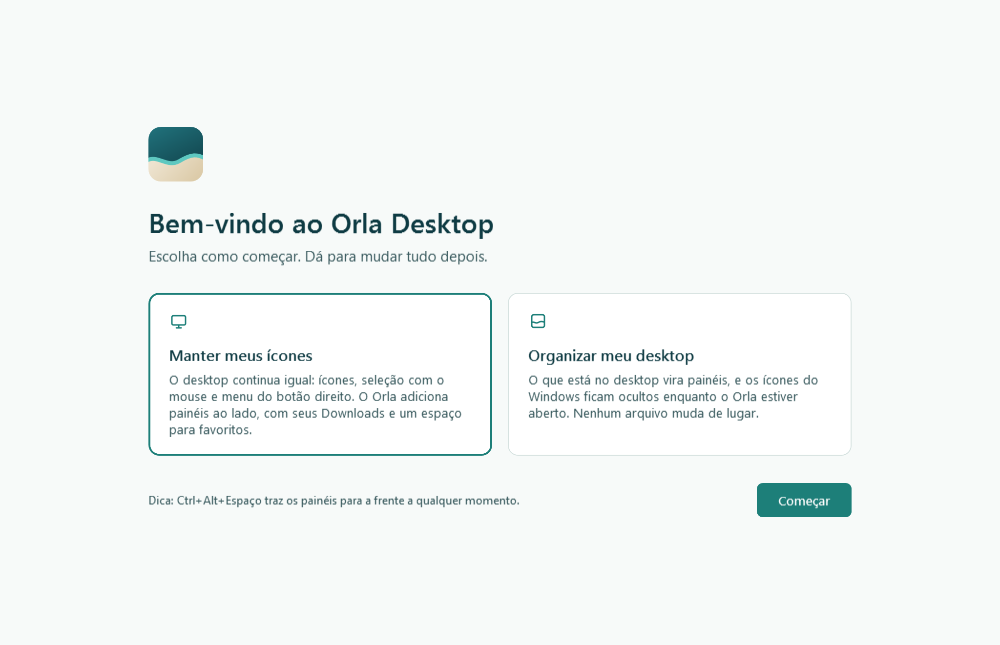
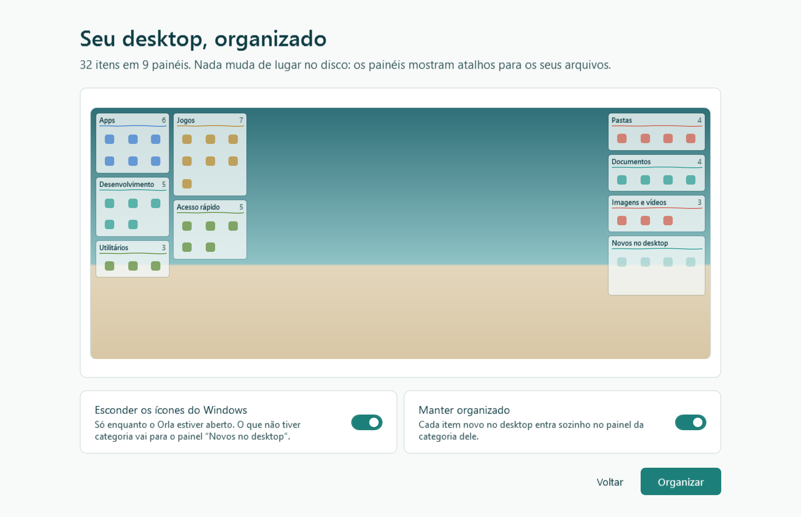
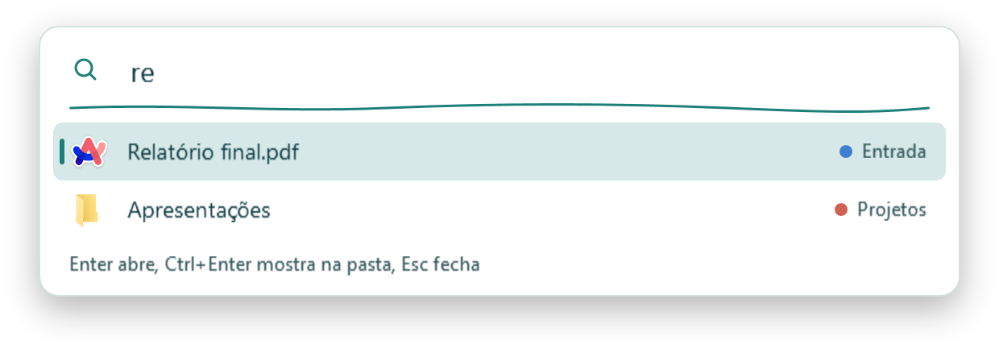
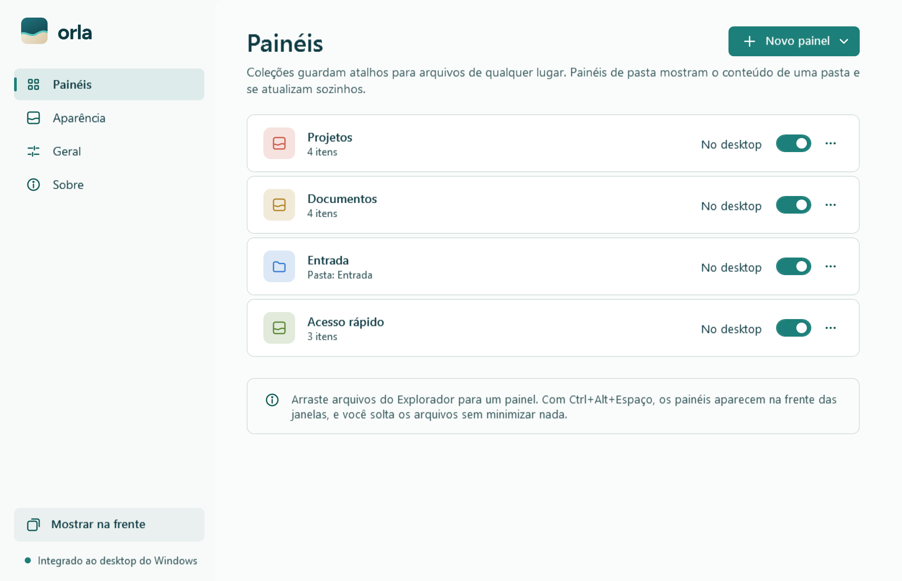
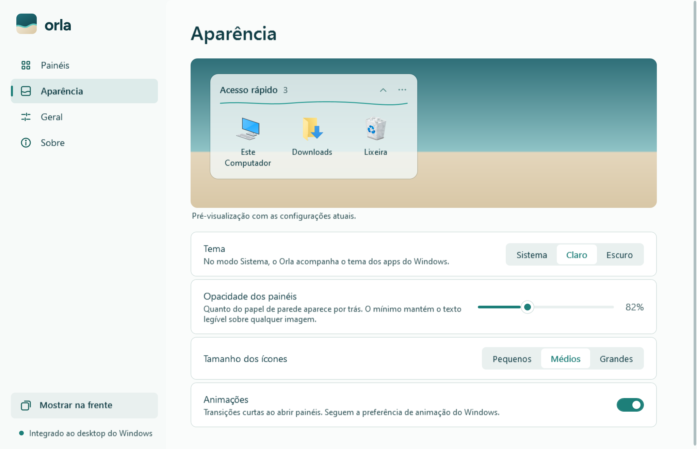

[English](../en/guide.md) · **Português**

# Guia de uso do Orla Desktop

O Orla coloca painéis translúcidos no desktop do Windows. Cada painel mostra atalhos ou o conteúdo de uma pasta. Seus arquivos continuam onde estão; o Orla muda só a forma como você os vê.

- [Como os painéis funcionam](#como-os-painéis-funcionam)
- [Primeira vez](#primeira-vez)
- [Deixe o Orla organizar](#deixe-o-orla-organizar)
- [Painéis prontos](#painéis-prontos)
- [Coleções e painéis de pasta](#coleções-e-painéis-de-pasta)
- [Mover, redimensionar e organizar](#mover-redimensionar-e-organizar)
- [Itens nos painéis](#itens-nos-painéis)
- [Arrastar e soltar](#arrastar-e-soltar)
- [O atalho de teclado](#o-atalho-de-teclado)
- [Busca rápida](#busca-rápida)
- [Desktop limpo](#desktop-limpo)
- [Janela do Orla](#janela-do-orla)
- [Teclado](#teclado)
- [Vários monitores](#vários-monitores)
- [Onde ficam seus dados](#onde-ficam-seus-dados)
- [Solução de problemas](#solução-de-problemas)
- [Perguntas frequentes](#perguntas-frequentes)
- [Desinstalar](#desinstalar)

## Como os painéis funcionam

Os painéis ficam na mesma camada dos ícones do desktop, dentro da janela do Explorador que guarda esses ícones. Por isso:

- **Win+D** e o botão de mostrar a área de trabalho, no canto da barra de tarefas, deixam os painéis à vista.
- Um painel nunca cobre um aplicativo aberto. Quando uma janela está por cima do desktop, ela também está por cima dos painéis.
- Nas áreas do desktop sem painel, tudo funciona como no Windows: seleção com o mouse, menu do botão direito e arrastar arquivos para o desktop.

O atalho de teclado, **Ctrl+Alt+Espaço** por padrão, esconde ou mostra os painéis quando o desktop está à vista e traz os painéis para a frente quando há uma janela por cima. Veja [O atalho de teclado](#o-atalho-de-teclado).

O ícone do Orla fica na bandeja, ao lado do relógio. Um clique abre a janela do Orla. O clique direito mostra o menu com **Abrir o Orla**, **Esconder painéis** (ou **Mostrar painéis**), **Mostrar painéis na frente**, **Organizar para mim**, **Travar painéis**, **Desktop limpo** e **Sair e restaurar o desktop**.

## Primeira vez

<picture>
  <source media="(prefers-color-scheme: dark)" srcset="../images/welcome-dark.png">
  
</picture>

Na primeira vez que o Orla abre, a tela **Bem-vindo ao Orla Desktop** oferece duas formas de começar. Escolha uma e clique em **Começar**.

| Opção | O que acontece |
| --- | --- |
| **Deixe o Orla organizar** (recomendado, já vem marcada) | O Orla lê o desktop, monta os painéis por categoria e mostra uma prévia antes de aplicar. Veja [Deixe o Orla organizar](#deixe-o-orla-organizar). |
| **Manter meus ícones** | Os ícones do Windows continuam como estão. No passo seguinte, **Escolha seus primeiros painéis**, você marca os [painéis prontos](#painéis-prontos) que quer e clica em **Começar**. **Voltar** retorna ao primeiro passo. |

Nenhuma das opções move, renomeia ou apaga arquivos. Você pode mudar tudo depois.

## Deixe o Orla organizar

<picture>
  <source media="(prefers-color-scheme: dark)" srcset="../images/organize-dark.png">
  
</picture>

O Orla pode montar os painéis para você, do jeito que uma pessoa arrumaria o desktop. Use na primeira vez, com **Deixe o Orla organizar**, ou a qualquer momento em **Painéis > Organizar para mim**.

1. O Orla lê o desktop e a área de trabalho pública do Windows.
2. A tela **Seu desktop, organizado** mostra um mapa da sua tela principal com cada painel onde ele vai ficar.
3. Escolha as opções e clique em **Organizar**. **Voltar** sai sem mudar nada.

Como ele separa os itens:

| Painel | O que entra |
| --- | --- |
| **Apps** | Navegadores, comunicação, música e os demais programas |
| **Desenvolvimento** | Editores de código, Git, Docker, bancos de dados, terminais |
| **Criação** | Edição de imagem e vídeo, design, transmissão |
| **Utilitários** | Scripts (`.bat`, `.cmd`, `.ps1`), periféricos, drivers e ferramentas do sistema |
| **Jogos** | Jogos e lançadores (Steam, Epic, EA, Riot, Rockstar, FiveM, Minecraft e outros) |
| **Pastas** | As pastas do desktop |
| **Documentos**, **Imagens e vídeos**, **Arquivos** | Arquivos soltos no desktop, por tipo. Instaladores e compactados vão para **Arquivos**. |
| **Acesso rápido** | Este Computador, Downloads, Documentos, Imagens e Lixeira |

- Um atalho é classificado pelo programa que ele abre, não pelo nome.
- Uma pasta que só guarda atalhos e scripts, como `Atalhos\Jogos`, é lida por dentro. Se o nome dela indica uma categoria (Jogos, Dev, Utilitários, Periféricos, Aplicativos…), essa categoria vale para o que está dentro.
- Uma categoria com um item só entra na mais próxima: um jogo sozinho vai para **Apps**, um PDF sozinho vai para **Arquivos**.
- As ferramentas ficam em colunas a partir da esquerda da tela principal; pastas, arquivos e **Novos no desktop**, a partir da direita. O centro fica livre.
- Os painéis mostram atalhos. Nenhum arquivo muda de lugar.

### Organizar de novo

Se você já usou o **Deixe o Orla organizar**, a prévia mostra duas formas no alto:

| Forma | O que faz |
| --- | --- |
| **Completar meus painéis** (padrão) | Só acrescenta o que é novo no desktop. Os itens entram nos painéis que você já tem; um painel novo só aparece para uma categoria que nenhum deles cobre, num espaço livre. Nomes, cores, posições, tamanhos e o que você moveu ficam como estão. No mapa, os painéis novos ficam em destaque, os que recebem itens mostram quantos (por exemplo, **+3**), e os outros ficam apagados. |
| **Refazer do zero** | Monta todos os painéis de novo, como na primeira vez. |

### O Orla aprende com você

Quando você arrasta um item de um painel para outro, ou do desktop (e do **Novos no desktop**) para um painel, o Orla guarda para onde ele foi, pelo que o atalho abre, com os argumentos, ou pelo nome do arquivo. Da próxima vez que organizar, e com **Manter organizado** ligado, esse item vai direto para aquele painel, mesmo que seja um painel que você criou. **Refazer do zero** leva as regras para o painel novo da mesma categoria; as regras de um painel que você apagou somem com ele.

### Com dois monitores

Com mais de um monitor, a prévia mostra todos eles e oferece **Usar o segundo monitor**, já ligado. As ferramentas vão para o outro monitor, no lado que fica perto da tela principal, e pastas, arquivos e **Novos no desktop** ficam na tela principal. **Completar meus painéis** não muda nada de monitor.

As duas opções da prévia:

| Opção | O que faz |
| --- | --- |
| **Esconder os ícones do Windows** | Liga o [Desktop limpo](#desktop-limpo) e cria o painel **Novos no desktop**, com o que ainda não está em nenhum painel. Se você desligar, os ícones do Windows continuam e esse painel não é criado, porque os próprios ícones já mostram o que é novo. |
| **Manter organizado** | Cada item novo no desktop entra sozinho no painel da categoria dele, uns segundos depois de chegar. Um item apagado ou tirado do desktop sai do painel. O que não se encaixar fica em **Novos no desktop**. Dá para ligar e desligar depois em **Painéis**. |

Com **Refazer do zero**, os painéis que você tinha são substituídos. Uma cópia do layout anterior fica na [pasta de dados](#onde-ficam-seus-dados) com o nome `layout.json.before-organize-` seguido da data, e **Painéis > Voltar aos painéis anteriores** desfaz a organização, mesmo depois de fechar e abrir o Orla. Cada cópia serve para desfazer uma vez.

## Painéis prontos

<picture>
  <source media="(prefers-color-scheme: dark)" srcset="../images/presets-dark.png">
  
</picture>

Painéis prontos ajudam a começar rápido. Eles aparecem no segundo passo da primeira vez e, depois, no botão **Novo painel** da página **Painéis**. O Orla só mostra os que fazem sentido no seu computador.

| Painel | Tipo | O que mostra |
| --- | --- | --- |
| **Acesso rápido** | Coleção | Este Computador, Downloads, Documentos, Imagens e Lixeira |
| **Downloads** | Painel de pasta | A pasta Downloads |
| **Aplicativos** | Coleção | Os atalhos de programas do desktop. Só aparece se houver algum. |
| **Jogos** | Coleção | Jogos e lançadores encontrados no desktop e no menu Iniciar |
| **Documentos** | Painel de pasta | A pasta Documentos |
| **Imagens** | Painel de pasta | A pasta Imagens, com miniaturas |
| **Capturas de tela** | Painel de pasta | A pasta de capturas de tela dentro de Imagens. Só aparece se ela existir. |
| **Recentes** | Painel de pasta | Os arquivos que você abriu por último, os mais novos primeiro (até 40) |
| **Novos no desktop** | Painel de pasta | O que está no desktop e ainda não foi para nenhum painel. Combina com o Desktop limpo. |
| **Trabalho** | Coleção | Vazia, para você preencher |
| **Estudos** | Coleção | Vazia, para você preencher |

Na primeira vez, **Acesso rápido**, **Downloads** e **Aplicativos** já vêm marcados.

O painel **Jogos** reconhece um atalho pelo lugar para onde ele aponta: links da Steam (`steam://`) e da Epic (`com.epicgames.launcher://`), links da Riot, da EA, da Ubisoft, da Battle.net, da GOG e da Rockstar, ou as pastas onde essas lojas e o Xbox instalam os jogos. Se um jogo não aparecer, arraste o atalho dele para o painel.

Montar um painel pronto nunca move nem copia arquivos. As coleções guardam atalhos, e os painéis de pasta mostram a pasta no lugar onde ela está.

## Coleções e painéis de pasta

| | Coleção | Painel de pasta |
| --- | --- | --- |
| Mostra | Atalhos para arquivos, pastas e locais de qualquer lugar | O conteúdo real de uma pasta |
| Ao soltar arquivos | Cria atalhos; os arquivos ficam onde estão | Move ou copia os arquivos para a pasta |
| Ao tirar um item | Remove só o atalho | Não se aplica; o painel sempre reflete a pasta |
| Atualização | O atalho acompanha o arquivo se você o renomear no Explorador | Automática, quando algo muda na pasta |

### Coleções

Uma coleção junta atalhos para o que você usa, venham de onde vierem: uma pasta de projeto em outro disco, uma planilha nos Documentos, um aplicativo. O arquivo nunca sai do lugar.

Se o arquivo for renomeado no Explorador, o item da coleção acompanha. Se ele for apagado, ou se o disco for desconectado, o item aparece esmaecido, com um sinal de aviso. Ao passar o mouse, a dica diz "Este item não está mais neste lugar." Use o menu do item para tirá-lo do painel.

Para adicionar itens sem arrastar, abra o menu **···** do painel e escolha **Adicionar arquivos…** ou **Adicionar pasta…**.

### Painéis de pasta

Um painel de pasta mostra o que está dentro de uma pasta, com pastas primeiro e em ordem alfabética, como no Explorador. Arquivos ocultos e de sistema não aparecem. O painel se atualiza sozinho quando algo é criado, apagado ou renomeado na pasta.

Clique duas vezes em uma subpasta para entrar nela ali mesmo. O título mostra o caminho, como **Projetos › FiveM**, e o botão **‹** (ou Backspace, ou Alt+←) volta um nível. Arrastar arquivos para o painel leva para a pasta que ele mostra no momento. Para abrir a subpasta no Explorador, use Ctrl+clique duplo ou **Abrir no Explorador** no menu do item. Quando o Orla abre de novo, o painel volta para a pasta dele.

O painel **Novos no desktop** mostra a sua área de trabalho e a área de trabalho pública do Windows. No menu **···** dele, **Mostrar só o que não está em outro painel** esconde o que já aparece em outro painel: o próprio item, uma pasta cujos atalhos estão em coleções ou uma pasta que tem um painel próprio. Assim, o que você salvar no desktop depois aparece ali até você organizar.

Se a pasta de um painel não for encontrada, por exemplo porque o disco foi desconectado, o painel avisa: "A pasta deste painel não foi encontrada. Verifique se o disco está conectado."

### Criar, ocultar e remover painéis

Na janela do Orla, em **Painéis**, o botão **Novo painel** abre uma lista com:

- os [painéis prontos](#painéis-prontos) disponíveis no seu computador;
- **Nova coleção**, que pede um nome e cria uma coleção vazia;
- **Painel de pasta**, que pede a pasta que o painel vai mostrar.

Na lista de painéis:

- Cada painel de pasta mostra o nome da pasta. Pare o mouse sobre ele para ver o caminho completo.
- A chave **No desktop** mostra ou oculta cada painel sem apagá-lo.
- O menu **···** de cada linha tem **Renomear painel**, **Cor da linha**, **Abrir pasta** (em painéis de pasta) e **Remover painel…**.

No próprio painel, o menu **···** (**Mais opções**) oferece:

- Em coleções: **Adicionar arquivos…** e **Adicionar pasta…**.
- Em painéis de pasta: **Abrir pasta**.
- Em todos: **Renomear painel**, **Cor da linha**, **Recolher** ou **Expandir**, **Altura automática**, **Ocultar painel**, **Abrir o Orla** e **Remover painel…**.

Remover um painel nunca apaga arquivos. Em uma coleção, somem só os atalhos. Em um painel de pasta, a pasta continua intacta.

A **Cor da linha** muda a linha fina abaixo do título: **Vidro do mar**, **Areia**, **Coral**, **Céu** ou **Musgo**.

## Mover, redimensionar e organizar

- **Mover:** arraste o painel pelo título. Durante o arraste, ele gruda nas margens da tela e nas bordas dos painéis próximos, mantendo o mesmo espaço entre eles, e fica dentro da área útil da tela.
- **Redimensionar:** arraste qualquer borda ou canto. Uma linha fina na cor de destaque mostra a borda sob o ponteiro. O painel acompanha o ponteiro e mostra o tamanho em colunas × linhas. Ao soltar, ele se ajusta suavemente a colunas e linhas inteiras de ícones, então não sobra faixa vazia. As bordas param na margem da tela e nos painéis vizinhos.
- **Altura automática:** vem ligada em painéis novos. O painel fica da altura do conteúdo, até o número de linhas definido; a partir daí, ganha rolagem. Se você mudar a altura com o mouse, a opção se desliga e o painel mantém exatamente as linhas que você escolheu. Para ligá-la de novo, clique duas vezes na borda de cima ou de baixo, ou marque **Altura automática** no menu **···**.
- **Sem sobreposição:** um painel nunca fica por cima de outro. Se você soltar ou aumentar um painel sobre outro, ele vai para o espaço livre mais próximo.
- **Renomear:** clique duas vezes no título, digite o novo nome e aperte Enter. Esc cancela.
- **Recolher:** a seta no lado direito da barra de título deixa só a barra de título à vista. Clique de novo para expandir.
- **Travar:** em **Geral**, **Travar posição e tamanho** evita mover ou redimensionar sem querer. O mesmo ajuste está no menu da bandeja como **Travar painéis**.
- **Reorganizar:** em **Geral**, **Reorganizar painéis** reorganiza os painéis visíveis na tela principal do mesmo jeito que o **Deixe o Orla organizar**: as ferramentas à esquerda (se o Desktop limpo estiver ligado), o resto à direita e o centro livre. Os painéis de cada lado ficam com a mesma largura.

## Itens nos painéis

| Para | Faça |
| --- | --- |
| Abrir | Clique duplo ou Enter |
| Selecionar vários | Ctrl+clique, Shift+clique, Ctrl+A, ou arraste um retângulo sobre uma área vazia do painel |
| Mudar o nome mostrado (coleções) | F2, ou **Renomear no painel** no menu do item |
| Tirar do painel (coleções) | Del, ou **Tirar do painel** no menu do item |
| Levar para outra coleção | Arraste até ela, ou use **Mover para** no menu do item |
| Pôr um arquivo de pasta em uma coleção | **Adicionar a** no menu do item, ou arraste até a coleção |
| Ver o arquivo no Explorador | **Mostrar no Explorador** no menu do item |

**Renomear no painel** muda só o nome exibido. O arquivo continua com o nome original.

Com vários itens selecionados, você pode arrastar, abrir ou tirar todos de uma vez.

## Arrastar e soltar

| De | Para | Resultado |
| --- | --- | --- |
| Explorador ou desktop | Coleção | Cria atalhos. Os arquivos ficam onde estão. |
| Coleção | Outra coleção | Leva o atalho para a outra coleção |
| Coleção | A mesma coleção | Muda a ordem dos itens |
| Coleção | Explorador ou desktop | Copia o arquivo, ou cria um atalho se você segurar Alt. O original nunca sai do lugar. |
| Coleção | Painel de pasta | Copia o arquivo para a pasta. O original nunca sai do lugar. |
| Explorador ou desktop | Painel de pasta | Move o arquivo para a pasta, se estiver no mesmo disco, ou copia, se estiver em outro disco |
| Painel de pasta | Coleção | Cria um atalho para o arquivo |
| Painel de pasta | Explorador ou desktop | Segue as regras normais do Windows, porque o arquivo é real |

Enquanto você arrasta itens do Orla, uma prévia translúcida do item acompanha o ponteiro, com um número quando são vários, por cima do Orla e de outros programas. Em coleções, uma linha mostra exatamente onde os itens vão entrar, no mesmo painel ou em outro. Perto da borda de cima ou de baixo de um painel, ele rola sozinho. Depois de soltar, os itens movidos continuam selecionados no destino. Arquivos arrastados do Explorador mostram a imagem de arraste do próprio Windows sobre os painéis.

Ao soltar em um painel de pasta, segure **Ctrl** para copiar ou **Shift** para mover, como no Explorador. A operação usa a janela do próprio Windows, com progresso e aviso de conflito de nomes, e pode ser desfeita com Ctrl+Z no Explorador.

## O atalho de teclado

O atalho é **Ctrl+Alt+Espaço** por padrão, e você pode trocá-lo em **Geral**. Ele faz o que o momento pede:

| Situação | O que o atalho faz |
| --- | --- |
| Desktop à vista (o foco está no desktop, na barra de tarefas ou em um painel) | Esconde os painéis, ou mostra de novo. Com o **Desktop limpo** ligado, os ícones do Windows voltam enquanto os painéis estão escondidos. |
| Uma janela de aplicativo na frente | Traz os painéis para a frente das janelas, com a [busca rápida](#busca-rápida) aberta. Aperte de novo, ou Esc, para devolvê-los ao desktop. |

Os painéis sempre começam visíveis quando o Orla abre.

### Soltar arquivos com janelas abertas

Normalmente, as janelas abertas ficam por cima dos painéis. Para soltar um arquivo do Explorador em um painel sem minimizar nada:

1. Com a janela do Explorador na frente, aperte o atalho. Os painéis aparecem na frente de todas as janelas.
2. Arraste o arquivo do Explorador até o painel.
3. Aperte o atalho de novo, ou Esc com um painel em foco, para devolver os painéis ao desktop.

Abrir um item ou usar **Mostrar no Explorador** também devolve os painéis ao desktop.

### Pela bandeja e pela janela do Orla

O menu da bandeja tem **Esconder painéis** (ou **Mostrar painéis**, se estiverem escondidos) e **Mostrar painéis na frente**, com o atalho atual ao lado. Na janela do Orla, o botão **Mostrar na frente** faz o mesmo; enquanto os painéis estão na frente, ele vira **Voltar ao desktop**.

### Trocar a combinação

Em **Geral**:

- **Atalho de teclado** liga ou desliga o atalho. A descrição mostra a combinação atual.
- Em **Combinação de teclas**, clique no botão e pressione a nova combinação: Ctrl, Alt ou Win junto com outra tecla. Esc cancela.
- **Restaurar padrão** volta para **Ctrl+Alt+Espaço**.

Se outro programa já usa a combinação escolhida, o Orla mantém a anterior e avisa. Veja [O atalho não funciona](#o-atalho-não-funciona).

## Busca rápida

<picture>
  <source media="(prefers-color-scheme: dark)" srcset="../images/search-dark.png">
  
</picture>

A busca procura em tudo o que os painéis mostram, inclusive o conteúdo dos painéis de pasta. Ela abre:

- junto com os painéis, quando o atalho os traz para a frente de uma janela;
- quando você começa a digitar com um painel selecionado;
- pelo item **Buscar nos painéis** do menu da bandeja.

Acentos e maiúsculas não importam. Primeiro vêm os nomes que começam com o que você digitou, depois os que têm uma palavra começando assim. Use as setas para escolher, **Enter** para abrir, **Ctrl+Enter** para mostrar o item na pasta dele e **Esc** para fechar. Clicar fora também fecha.

## Desktop limpo

**Desktop limpo** esconde os ícones do Windows e deixa só os painéis. Ele vem desligado, a não ser que você use **Deixe o Orla organizar** com **Esconder os ícones do Windows** ligado. Para ligar ou desligar, use **Geral > Desktop limpo** ou o item **Desktop limpo** no menu da bandeja.

Com ele ligado:

- Os ícones do Windows e a seleção com o mouse no desktop ficam indisponíveis.
- Os arquivos continuam na pasta da área de trabalho. Para vê-los, use o painel **Novos no desktop**, em **Novo painel**, ou crie um **Painel de pasta** da área de trabalho.

### Como o Orla protege seus ícones

Antes de esconder os ícones, o Orla inicia um pequeno processo de proteção, uma segunda cópia do próprio Orla sem janela. Ele espera o Orla terminar, de qualquer forma que isso aconteça, e então devolve os ícones.

Os ícones voltam quando você:

- desliga **Desktop limpo**;
- escolhe **Sair e restaurar o desktop** ou **Sair do Orla**;
- desinstala o Orla;
- ou quando o Orla trava ou é encerrado pelo Gerenciador de Tarefas.

O estado restaurado é a sua configuração do Explorador, em **Exibir > Mostrar ícones da área de trabalho** no menu do botão direito do desktop. Se você mesmo deixou os ícones desligados ali, eles continuam desligados.

Se o Orla não conseguir iniciar a proteção, ele não esconde os ícones e avisa: "Não foi possível iniciar a proteção que devolve os ícones. Os ícones do Windows continuam visíveis."

## Janela do Orla

Abra com um clique no ícone da bandeja, pelo menu **···** de um painel (**Abrir o Orla**) ou executando o Orla de novo.

<picture>
  <source media="(prefers-color-scheme: dark)" srcset="../images/central-dark.png">
  
</picture>

A janela tem quatro páginas:

- **Painéis:** cria, mostra, oculta e remove painéis. Veja [Criar, ocultar e remover painéis](#criar-ocultar-e-remover-painéis).
- **Aparência:** tema, opacidade, ícones e animações, com uma pré-visualização ao vivo.
- **Geral:** inicialização, **Desktop limpo**, atalho, trava, idioma, **Reorganizar painéis** e **Recomeçar do zero**.
- **Sobre:** versão, pasta dos seus dados, **Guia de uso**, **Relatar um problema** e **Sair do Orla**.

No rodapé da barra lateral, **Integrado ao desktop do Windows** indica que os painéis estão na camada do desktop. Se aparecer **Modo compatível: não encontrei o desktop do Windows.**, veja [Solução de problemas](#o-orla-mostra-modo-compatível).

### Aparência

<picture>
  <source media="(prefers-color-scheme: dark)" srcset="../images/appearance-dark.png">
  
</picture>

| Ajuste | Opções |
| --- | --- |
| **Tema** | **Sistema** acompanha o tema dos apps do Windows na hora em que você o muda. **Claro** e **Escuro** fixam um tema. |
| **Opacidade dos painéis** | De 75% a 95%. O mínimo mantém o texto legível sobre qualquer papel de parede. |
| **Tamanho dos ícones** | **Pequenos**, **Médios** ou **Grandes** |
| **Animações** | Transições curtas quando os painéis aparecem. Se as animações estiverem desligadas no Windows, o Orla também não anima. |

Mudanças de tema e de opacidade valem na hora, nos painéis e na janela do Orla.

Com o Alto Contraste do Windows ligado, o Orla usa as cores do sistema e desliga a transparência.

### Geral

| Ajuste | O que faz |
| --- | --- |
| **Iniciar com o Windows** | Abre os painéis quando você entra no Windows. Vem ligado. |
| **Desktop limpo** | Esconde os ícones do Windows. Veja [Desktop limpo](#desktop-limpo). |
| **Atalho de teclado** | Liga ou desliga o atalho. Veja [O atalho de teclado](#o-atalho-de-teclado). |
| **Combinação de teclas** | Troca a combinação do atalho. **Restaurar padrão** volta para **Ctrl+Alt+Espaço**. |
| **Travar posição e tamanho** | Impede mover ou redimensionar painéis |
| **Idioma** | **Sistema** segue o idioma de exibição do Windows. Você também pode escolher Português (Brasil), English, Español, Français, Deutsch ou Italiano. A troca vale na hora. |
| **Reorganizar painéis** | O botão **Reorganizar** reorganiza os painéis visíveis na tela principal do mesmo jeito que o **Deixe o Orla organizar**: as ferramentas à esquerda (se o Desktop limpo estiver ligado), o resto à direita e o centro livre. Os painéis de cada lado ficam com a mesma largura. |
| **Recomeçar do zero** | O botão **Recomeçar…** tira todos os painéis, volta os ajustes ao padrão e abre a tela **Bem-vindo ao Orla Desktop**, como numa instalação nova. Antes, o Orla guarda uma cópia do layout atual na pasta de dados, com o nome `layout.json.before-reset-<data>`. Nenhum arquivo seu é movido ou apagado, e **Iniciar com o Windows** fica como estava. Para voltar ao layout anterior, saia do Orla e renomeie essa cópia para `layout.json`. |
| **Atualizações automáticas** | Só na versão instalada. A chave começa ligada. Veja [Atualizações](#atualizações). |

### Atualizações

A versão instalada e a portátil procuram uma versão nova no GitHub um minuto depois de abrir e, depois, a cada seis horas. Você não precisa voltar ao GitHub nem baixar nada. Quando encontra, baixa em segundo plano e aplica na próxima vez que o Orla fechar. Se você desligar o Windows com o Orla aberto, a atualização é aplicada na próxima vez que ele abrir, um ou dois segundos antes de os painéis aparecerem. A busca pede ao GitHub a lista de versões deste repositório e não envia dados pessoais. Na página **Sobre**, o cartão **Atualizações** mostra quando foi a última busca e tem o botão **Buscar agora**. Quando uma versão nova estiver pronta, o botão vira **Reiniciar e atualizar**, para instalar na hora. Depois de atualizar, um aviso na bandeja leva às novidades da versão. Para desligar as buscas automáticas, use **Atualizações automáticas** em **Geral**; **Buscar agora** continua funcionando.

A versão portátil precisa estar numa pasta em que você possa gravar, como Documentos ou Downloads, para se atualizar. Seus painéis ficam em `%LOCALAPPDATA%\Orla` e não são afetados.

## Teclado

| Tecla | Onde | Ação |
| --- | --- | --- |
| Ctrl+Alt+Espaço (padrão, configurável) | Desktop à vista | Esconde ou mostra os painéis |
| Ctrl+Alt+Espaço (padrão, configurável) | Janela de aplicativo na frente | Traz os painéis para a frente, ou devolve ao desktop |
| Esc | Painel na frente, com foco | Devolve os painéis ao desktop |
| Enter | Item | Abre |
| Setas | Item | Move a seleção |
| Ctrl+A | Painel | Seleciona todos os itens |
| F2 | Item de coleção | **Renomear no painel** |
| Del | Item de coleção | **Tirar do painel** |
| Tecla de menu | Item | Abre o menu do item |
| Enter ou Esc | Título em edição | Confirma ou cancela o novo nome |

## Vários monitores

Você pode pôr painéis em qualquer monitor. Cada painel usa a escala do monitor em que está e fica dentro da área útil dele. Se um monitor for desconectado, os painéis que estavam nele passam para o monitor mais próximo. **Reorganizar painéis** leva todos os painéis visíveis para a tela principal.

Monitores com escalas diferentes, como um notebook em 150% e um monitor externo em 100%, ainda não foram testados. Se algo parecer fora do lugar nessa situação, [relate o problema](https://github.com/ThePlayNEW/orla-desktop/issues/new/choose).

## Onde ficam seus dados

Tudo fica em `%LOCALAPPDATA%\Orla`, tanto na versão instalada quanto na portátil. Em **Sobre**, o botão **Abrir pasta** abre essa pasta.

| Arquivo | Conteúdo |
| --- | --- |
| `layout.json` | Painéis, itens, posições e ajustes |
| `layout.json.bak` | A versão anterior, criada a cada salvamento |
| `layout.json.corrupt-<data>` | Uma cópia de um arquivo que não pôde ser lido, guardada para você não perder nada |
| `layout.json.before-organize-<data>` | Os painéis de antes de cada **Deixe o Orla organizar**, para **Voltar aos painéis anteriores** |
| `orla.log` | Erros inesperados, se houver algum, com os caminhos da sua pasta de usuário trocados por `%USERPROFILE%` |

O Orla salva em um arquivo temporário e só depois troca pelo definitivo, então uma queda de energia no meio do salvamento não corrompe o layout. Se o `layout.json` não puder ser lido, o Orla usa o `.bak` e avisa: "Seus painéis foram recuperados da última cópia salva."

O layout guarda só caminhos e nomes. Para fazer backup, copie `layout.json`.

Os painéis com o nome que o Orla deu, como **Jogos** ou **Downloads**, mudam de nome quando você troca o idioma. Um nome que você escreveu fica como está.

O Orla não tem telemetria. Em **Sobre**, **Relatar um problema** abre o formulário do GitHub com a versão do Windows, a do Orla, os monitores e o último erro do `orla.log` já preenchidos. Nada é enviado até você revisar e publicar. O único acesso à rede é a busca por atualizações da versão instalada, descrita em [Atualizações](#atualizações).

## Solução de problemas

### Os ícones do Windows sumiram

1. Abra o Orla e veja se **Desktop limpo**, em **Geral**, está ligado. Se estiver, desligue.
2. Se o Orla não estiver aberto, clique com o botão direito em uma área vazia do desktop e escolha **Exibir > Mostrar ícones da área de trabalho**.
3. Se ainda assim os ícones não voltarem, reinicie o Explorador: abra o Gerenciador de Tarefas (Ctrl+Shift+Esc), procure **Windows Explorer** na aba **Processos**, clique com o botão direito e escolha **Reiniciar**.

Seus arquivos nunca saem da pasta da área de trabalho, mesmo com os ícones ocultos.

### O atalho não funciona

Se outro programa já usa a combinação, o Orla avisa ("Outro programa já usa…") e os painéis continuam disponíveis pelo menu da bandeja. Para resolver, escolha outra combinação em **Geral > Combinação de teclas**, ou libere a combinação no outro programa e ligue de novo **Atalho de teclado**.

Se você trocou a combinação e não lembra qual é, a descrição de **Atalho de teclado** e o menu da bandeja mostram a atual. **Restaurar padrão** volta para **Ctrl+Alt+Espaço**.

### O Windows mostrou um aviso do SmartScreen

Os executáveis do Orla ainda não têm assinatura digital, e o SmartScreen avisa sobre programas sem reputação. Confira se você baixou o arquivo da [página de versões](https://github.com/ThePlayNEW/orla-desktop/releases) deste repositório, clique em **Mais informações** e depois em **Executar assim mesmo**. A assinatura pelo SignPath Foundation está planejada.

### O Explorador reiniciou

Quando o Explorador reinicia, a camada do desktop é recriada. O Orla percebe isso e recoloca os painéis em cerca de um segundo, com o **Desktop limpo** no estado em que estava. Se os painéis não voltarem, saia pelo menu da bandeja e abra o Orla de novo.

### Um painel está fora da tela

Em **Geral**, clique em **Reorganizar** ao lado de **Reorganizar painéis**. Todos os painéis visíveis voltam para a tela principal, alinhados em colunas.

### Um painel sumiu

Se todos os painéis sumiram, eles podem ter sido escondidos pelo atalho. Aperte o atalho com o desktop à vista, ou escolha **Mostrar painéis** no menu da bandeja.

Se só um painel sumiu, ele pode ter sido ocultado. Abra o Orla, vá em **Painéis** e ligue a chave **No desktop** do painel.

### O Orla mostra "Modo compatível"

O Orla não encontrou a janela do desktop do Explorador e mostra os painéis em janelas comuns logo acima do desktop. Isso pode acontecer se o Explorador não estiver rodando ou se outro programa substituir o desktop. Reinicie o Explorador como descrito acima. Se o aviso continuar, [relate o problema](https://github.com/ThePlayNEW/orla-desktop/issues/new/choose) dizendo qual versão do Windows e qual programa de papel de parede você usa.

### Um item aparece como ausente

O arquivo foi apagado ou está em um disco desconectado. Reconecte o disco ou use **Tirar do painel** no menu do item.

## Perguntas frequentes

**O Orla move ou apaga meus arquivos?**
Não. Coleções só guardam atalhos. O único caso em que um arquivo muda de lugar é quando você o solta em um painel de pasta, e isso passa pela janela de cópia do próprio Windows, que permite desfazer.

**Posso usar o Orla com outro organizador de desktop?**
Use só um programa que esconde ou gerencia os ícones do desktop por vez. Dois programas fazendo isso ao mesmo tempo podem deixar os ícones em um estado inesperado.

**O Orla funciona com Wallpaper Engine?**
Sim. Os testes foram feitos com o Wallpaper Engine rodando no Windows 10. O Orla não mexe no papel de parede nem nas janelas do Wallpaper Engine. O Lively usa a mesma estrutura, mas ainda não foi testado.

**O Orla funciona no Windows 11?**
O código foi escrito para as estruturas de desktop do Windows 10 e do Windows 11, inclusive a do 24H2. O teste manual no Windows 11 ainda está pendente. Se você usar, conte como foi em [Issues](https://github.com/ThePlayNEW/orla-desktop/issues/new/choose).

**Quanta memória o Orla usa?**
Cerca de 100 MB com quatro painéis, incluindo o runtime do WPF. Parado, o uso de processador fica perto de zero, porque o Orla só trabalha quando algo muda.

**Posso levar meus painéis para outro computador?**
Pode copiar `layout.json` para `%LOCALAPPDATA%\Orla` no outro computador com o Orla fechado. Itens cujo caminho não existir lá aparecem como ausentes.

**Quantos painéis posso ter?**
Até 40 painéis, com até 3.000 itens em cada coleção.

## Desinstalar

Fechar, sair ou desinstalar o Orla nunca deixa o desktop alterado: os ícones do Windows voltam a seguir a configuração do Explorador.

- **Versão instalada:** abra **Configurações > Aplicativos**, procure **Orla Desktop** e clique em **Desinstalar**. A inicialização com o Windows é removida junto, e os ícones do Windows voltam.
- **Versão portátil:** em **Geral**, desligue **Iniciar com o Windows**. Depois escolha **Sair e restaurar o desktop** no menu da bandeja e apague a pasta onde você extraiu o ZIP.

Seus painéis continuam em `%LOCALAPPDATA%\Orla`, caso você volte a usar o Orla. Para apagá-los, digite `%LOCALAPPDATA%` na barra de endereço do Explorador, aperte Enter e exclua a pasta `Orla`.
